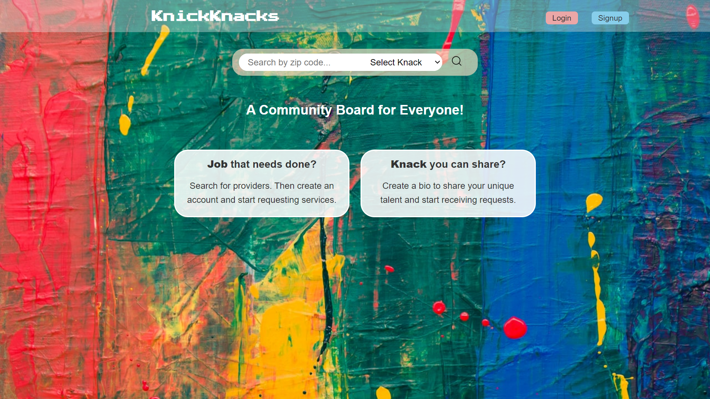
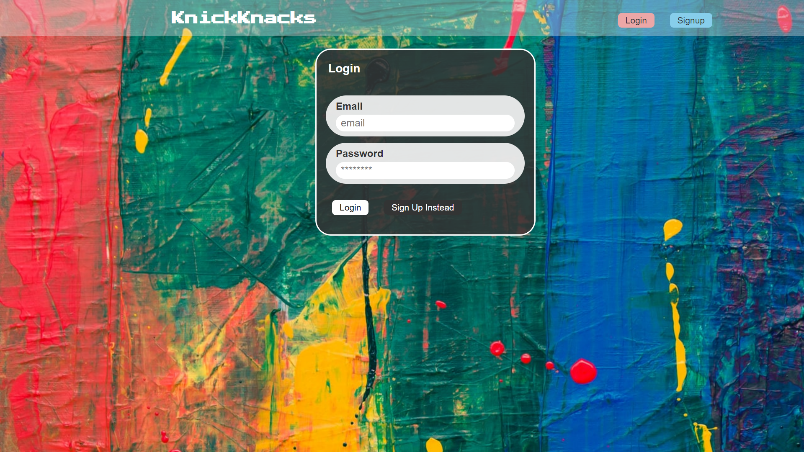
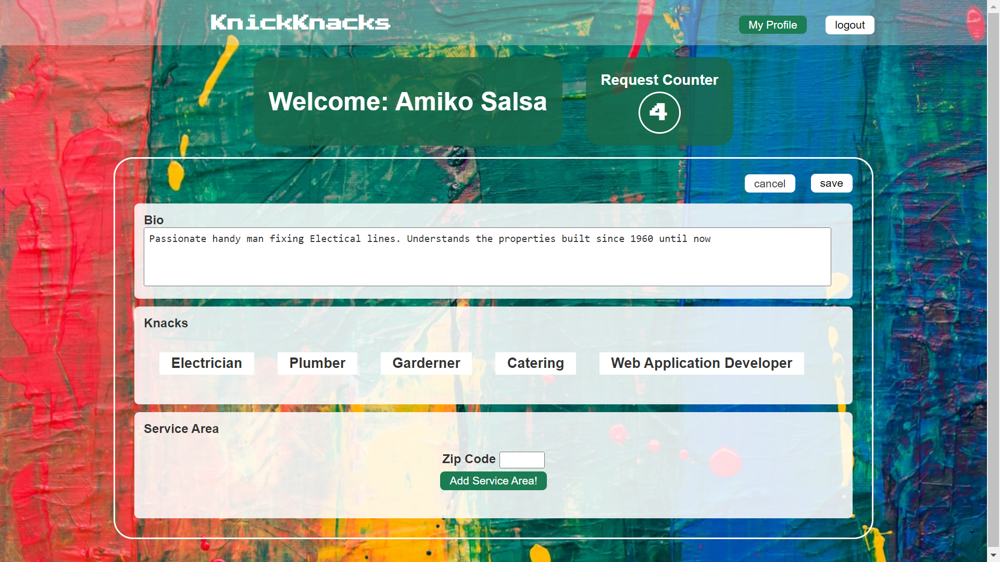

# KnickKnacks

## KnickKnacks on Demand

### A Jobs Board for Everyone!

# Description

The purpose of this project was to create a jobs board for small business, handyman and private individuals to share their knowledge and unique talents with others in the community. Have job that needs done? Search the by location. Have a need for a specific skill set or professional qualification? Search by skill or service type. Use this application to search for services or to offer your own services for others to peruse.

This application uses the Model Controller View approach to structure and organize the code. The template engine uses Handlebars, Sequelize as the ORM and Express-session for authentication. The database uses MySQL and JAWSDB when hosted on Heroku.

# Installation

To use this jobs board appliation no installation is necessary as the program is deployed on Heroku. To deploy an instance of your on version of a jobs board you must install Node, Express, Sequelizer, dotenv, bycrypt, express-session, connect-session-sequalize, MySQL, and Handlebars and Clone the code from this repository into your own directory. Copy and or rename .env.EXAMPLE file to .env and enter your MySQL credentials

Install Node: [Node.js](https://nodejs.org/en/download/).

Install Express: [Express.js](https://www.npmjs.com/package/express).

Install Express-session: [Express-session](https://www.npmjs.com/package/express-session).

Install Sequelize: [Sequelize.js](https://www.npmjs.com/package/sequelize).

Install Connect-session-sequelize: [Connect-session-sequelize](https://www.npmjs.com/package/connect-session-sequelize).

Install MySQL2 package: [MySQL2](https://www.npmjs.com/package/mysql2).

Install dotenv: [dotenv](https://www.npmjs.com/package/dotenv).

Install bycrypt: [bycrypt](https://www.npmjs.com/package/bcrypt).

Install Handlebars: [Handlerbars](https://www.npmjs.com/package/handlebars).

# Appearance

# Usage

Use this application to search for services near you, or create a bio to offer your own services. Reviews left by others will assist you in making a choice of service provider.

# Live page hosted on heroku

Link to live page: [Live page]().

## Credits

Credits to Node.js, Express.js, Express-sessions, Sequalize, Connect-session-sequalize, MySQL, dotenv, bycrypt, handlebars, and Heroku for hosting the site.
